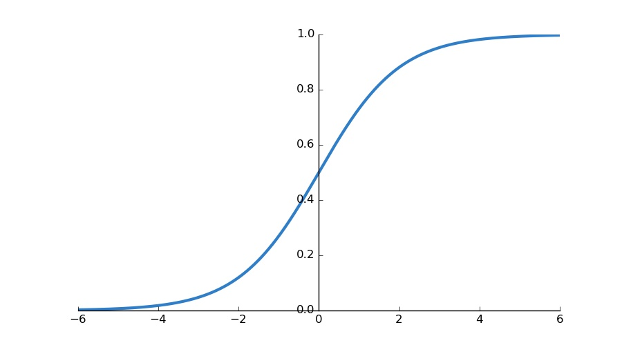

 
 

## Notation

- $m$ - # of examples
- $n$ - # of features
- $x$ - feature vector $(n \times 1)$
- $x^{(i)}_j$ - value of feature $j$ in $i^{th}$ training example
- $x^{(i)}$ - input features of $i^{th}$ training example
- $X$ - feature matrix $(m \times n)$
- w, $\theta$ - weight vector $(n \times 1)$
- y - label vector $(n \times 1)$
- $h$ - hypothesis
- $C, J$ - cost function
- $a^{(i)}_j$ - activation of the unit $i$ in layer $j$, $a^{(j)}_i=g(z^{(j)}_i)$
- $a^{(j)}$ - hidden feature vector, $a^{(j)}=g(z^{(j)})$<- vector of sigmoid activation
- $A$ - activation matrix
- $\Theta^{(j)}$ - matrix of weights controlling function mapping from layer $j$ to layer $j+1$
  - if a network has $s_j$ units in layer $j$, $s_{j+1}$ units in layer $j+1$, than $\Theta^{(j)}$ will be of dimension $(s_{j+1} \times s_j + 1)$
    - $s_{j+1}$ - next layer
    - $s_j + 1$ - current layer + bias
- $L$ - total layers in a network
- $s_l$ - # of units not counting bias in a layer
- $\alpha$ - learning rate
- K - number of output units/classes

## Hypothesis function

$$h_{\theta}(x)=\theta^Tx$$

 

$$h_{\theta}(X)=X\theta$$

 

$$h_{\Theta}(x) = g(\theta^Tx)$$

where $z = \theta^Tx$

 

$$z^{(j+1)} = \Theta^{(j)}a^{(j)}$$

 

$$h_{\Theta}(x) = a^{j+1} = g(z)^{j+1}$$

## Cost Functions

- Mean Squared Error (MSE)

$$\frac{1}{2m}\sum^m_{i=1}(h_{\theta}(x^{(i)})-y^{(i)})^2$$

- Binary Cross Entropy

$$J(\theta) = \frac{1}{m}(-y^T\log{h}-(1-y)^T\log(1-h))$$

## Normal Equation

- Closed form solution to Linear Regression
- Complexity $O(n^3)$

$$\theta = (X^TX)^{-1}X^Ty$$

## Gradient Descent

- complexity: $O(n^2)$

$$\theta := \theta - \alpha \frac{\partial}{\partial \theta}J(\theta)$$

## Sigmoid Function

Maps an output to (0 to 1)

$$g(z) = \frac{1}{1+e^{-z}}$$

 
 
